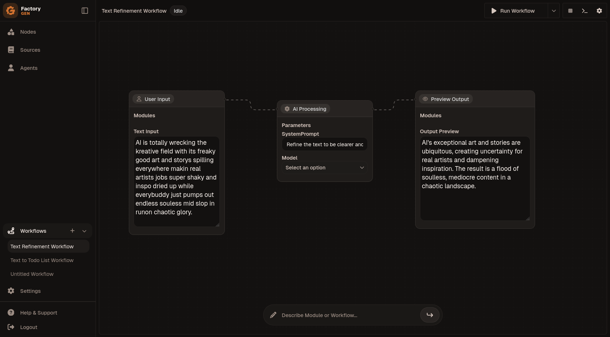

## Project Overview

Build and manage AI-powered workflows with ease. It features an intuitive visual canvas where users can construct complex workflows using a node-based interface. Leveraging Convex as its backend, FactoryGen provides real-time capabilities and robust data management for seamless workflow execution and interaction.

## Architecture

FactoryGen is built with a modern, full-stack architecture:

-   **Frontend:** Developed with Next.js, utilizing the `app` directory for routing and server components. The user interface is composed of React components (`components/`) that facilitate the visual workflow canvas and other interactive elements.
-   **Backend & Realtime Database:** Convex serves as the unified backend for FactoryGen. It handles:
    -   **Database:** Persistent storage for workflow definitions, nodes, and other application data.
    -   **Realtime Updates:** Provides real-time synchronization for a highly interactive user experience on the canvas.
    -   **Serverless Functions:** Executes backend logic and AI-related tasks (`convex/workflow_actions.ts`, `convex/nodes.ts`).-   **Styling:** Global CSS (`app/globals.css`) and PostCSS are used for styling.
-   **Development Tools:** The project uses TypeScript for type safety, ESLint for code quality, and pnpm for package management.

## Screenshots



## Getting Started

To get a local copy up and running, follow these simple steps.

### Prerequisites

*   Node.js (v18.x or later)
*   pnpm
*   Convex CLI

### Installation

1.  Clone the repository:
    ```bash
    git clone https://github.com/kyza/factory-gen
    cd factory-gen
    ```
2.  Install dependencies:
    ```bash
    pnpm install
    ```
3.  Set up Convex:
    ```bash
    npx convex init
    ```
    Follow the prompts to connect to your Convex project.
4.  Run the development server:
    ```bash
    pnpm dev
    ```

Open [http://localhost:3000](http://localhost:3000) with your browser to see the result.
